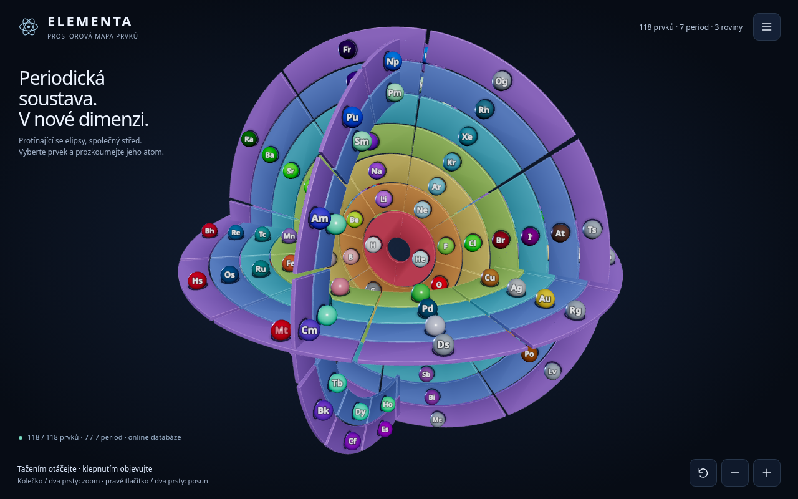

# ELEMENTA · Spatial Map of the Elements / Prostorová mapa prvků

Interactive 3D visualization of the periodic table in a single HTML file.
118 elements · 7 periods · 3 intersecting planes (electron blocks s / p / d / f).

Interaktivní 3D vizualizace periodické soustavy prvků v jediném HTML souboru.
118 prvků · 7 period · 3 protínající se roviny (elektronové bloky s / p / d / f).

---

## English

### Features

- **Spatial model** — three ellipses share a center and lie in mutually
  perpendicular planes; color encodes the period, plane encodes the electron block.
- **Detail of every element** — symbol, atomic number, Czech and English names,
  ground-state electron configuration, electrons per shell, physical properties
  and data source.
- **Exploring relations** — highlight a period, group / series or a comparison
  pair (e.g. La ↔ Ac); guides for the group 3 convention (Sc–Y–Lu–Lr).
- **Search** — by symbol, name or atomic number.
- **Appearance settings** — colors by periods / blocks / categories, labels,
  auto-rotation, band opacity, layer spacing, unfolding the planes,
  front / top / perspective views.
- **Czech / English** — language switch in the map and settings panel.

### Run

No installation, no build:

1. Download or clone the repository.
2. Open `index.html` in a modern browser (double-click is enough).
3. You need WebGL 2 and hardware acceleration.

The model and the embedded database **work offline**. If a connection is
available, the app tries to update the element data online.

### Controls

| Action | Input |
|---|---|
| Rotate | drag with mouse / finger |
| Zoom | wheel / two fingers, + / − buttons |
| Pan | right button / two fingers |
| Element detail | click / tap a sector |
| Default view | home button at the bottom left |

### Data and third-party licenses

- **Element database:** [Bowserinator / Periodic-Table-JSON](https://github.com/Bowserinator/Periodic-Table-JSON)
  · [CC BY-SA 3.0](https://creativecommons.org/licenses/by-sa/3.0/).
  Embedded backup: 118 elements (28 September 2026); data are updated online.
- **3D library:** Three.js + OrbitControls, embedded directly in the HTML · MIT
  (© 2010–2025 three.js authors).
- **Curriculum / facts:** [IUPAC – periodic table](https://iupac.org/what-we-do/periodic-table-of-elements/).

The ellipses are a map of the system, not electron trajectories. Sector sizes
and distances between them are not physical quantities. For the heaviest
elements some data are predicted.

### Author

**Mgr. Luděk Sušický** — biolog, středoškolský a vysokoškolský učitel informatických předmětů

- E-mail: [ludek.susicky@gmail.com](mailto:ludek.susicky@gmail.com)
- X: [@ludeksusicky](https://x.com/ludeksusicky)
- LinkedIn: [Luděk Sušický](https://www.linkedin.com/in/ludek-susicky/)

The app is an example of an SPA (Single Page Application) in a single HTML file.

### License

MIT © 2026 Luděk Sušický — see [LICENSE](LICENSE).
The MIT license covers the app's own code. Three.js and OrbitControls have
their own MIT license; the adopted database remains under CC BY-SA 3.0.

---

## Česky

### Co to umí

- **Prostorový model** — tři elipsy sdílejí střed a leží ve vzájemně kolmých
  rovinách; barva určuje periodu, rovina elektronový blok.
- **Detail každého prvku** — značka, protonové číslo, český i anglický název,
  elektronová konfigurace (základní stav), elektrony ve slupkách, fyzikální
  vlastnosti a zdroj dat.
- **Objevování souvislostí** — zvýraznění periody, skupiny / řady a srovnávací
  dvojice (např. La ↔ Ac); vodítka pro konvenci skupiny 3 (Sc–Y–Lu–Lr).
- **Vyhledávání** — podle značky, názvu nebo protonového čísla.
- **Nastavení vzhledu** — barvy podle period / bloků / kategorií, popisky,
  automatické otáčení, průsvitnost pásů, rozestup vrstev, rozložení rovin,
  pohledy zepředu / shora / perspektiva.
- **Čeština / angličtina** — přepínač jazyka v mapě a nastavení.

### Spuštění

Nic se neinstaluje, žádný build:

1. Stáhni nebo naklonuj repozitář.
2. Otevři `index.html` v moderním prohlížeči (dvojklik stačí).
3. Potřebuješ WebGL 2 a hardwarovou akceleraci.

Model i zabudovaná databáze **fungují bez internetu**. Je-li připojení
k dispozici, aplikace se pokusí aktualizovat data prvků online.

### Ovládání

| Akce | Vstup |
|---|---|
| Otočení | tažení myší / prstem |
| Zoom | kolečko / dva prsty, tlačítka + / − |
| Posun | pravé tlačítko / dva prsty |
| Detail prvku | kliknutí / klepnutí na sektor |
| Výchozí pohled | tlačítko domů vlevo dole |

### Data a licence třetích stran

- **Databáze prvků:** [Bowserinator / Periodic-Table-JSON](https://github.com/Bowserinator/Periodic-Table-JSON)
  · [CC BY-SA 3.0](https://creativecommons.org/licenses/by-sa/3.0/).
  Vložená záloha: 118 prvků (28. 9. 2026); online se data aktualizují.
- **3D knihovna:** Three.js + OrbitControls, vložené přímo v HTML · MIT
  (© 2010–2025 three.js authors).
- **Kurikulum / fakta:** [IUPAC – periodická soustava](https://iupac.org/what-we-do/periodic-table-of-elements/).

Elipsy jsou mapou soustavy, nikoli drahami elektronů. Velikosti sektorů ani
vzdálenosti mezi nimi nejsou fyzikální veličinou. U velmi těžkých prvků jsou
některé údaje předpovězené.

### Autor

**Mgr. Luděk Sušický** — biolog, středoškolský a vysokoškolský učitel informatických předmětů

- E-mail: [ludek.susicky@gmail.com](mailto:ludek.susicky@gmail.com)
- X: [@ludeksusicky](https://x.com/ludeksusicky)
- LinkedIn: [Luděk Sušický](https://www.linkedin.com/in/ludek-susicky/)

Aplikace je příkladem SPA (Single Page Application) v jediném HTML souboru.

### Licence

MIT © 2026 Luděk Sušický — viz [LICENSE](LICENSE).
Licence MIT platí pro vlastní kód aplikace. Three.js a OrbitControls mají
vlastní licenci MIT; převzatá databáze zůstává pod CC BY-SA 3.0.
